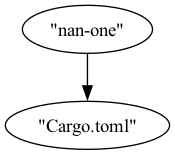
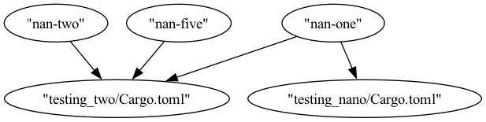

# NanoForge
Build and runner tool for nanoservices


## Installation

We want to work on packaging for operating systems later but for now you can install using the following command:

```bash
wget -qO- https://raw.githubusercontent.com/nanoservicesforge/NanoForge/main/scripts/install.py | python3
```

## Quickstart: using Docker as a crates registry with NanoForge

Even though NanoForge is a build tool for nanoservices, it can be used to build and run any Rust project as
NanoForge essentially scans all the `Cargo.toml` files in the subdirectories of the project. NanoForge then
collects all the Docker images declared in the `Cargo.toml` files and pulls them into a cache. NanoForge then
unpacks the files from the downloaded Docker images and calculates the relative path for each unpacked Docker
image. These relative paths are then inserted into the dependency section of the `Cargo.toml` files that declared
the Docker image. To test this, we can build a toy example by creating a new project with the command below:

```bash
cargo new nanoforge-test
````

In the `Cargo.toml` file, we then declare the following nanoservice:

```toml
[nanoservices.nan-one]
dev_image = "maxwellflitton/nan-one"
prod_image = "maxwellflitton/nan-one"
entrypoint = "."
```

This means that NanoForge will pull the `maxwellflitton/nan-one` Docker image and unpack it in the cache. The
`entrypoint` field is what is added to the relative path of the unpacked Docker image. This is useful if the
build needs to point to a particular subdirectory of the unpacked Docker image. We can then prepare the build
with the following command:

```bash
nanoforge prep
````

Once the Docker unpacking is done, we can see that the build is pointed to in the `Cargo.toml` file:

```toml
[dependencies.nan-one]
path = "../.nanoservices_cache/domain_services/nanoservices/maxwellflitton_nan-one/."
```

We can then use this package in our `main.rs` file with the following code:

```rust
use nan_one::hello;

fn main() {
    println!("Hello, world!");
    hello();
}
```

We can then perform a `cargo run` and we will see that we can use the code unpacked from the
Docker image. You can define multiple Dkcer images in your `Cargo.toml` file and NanoForge will
pull and unpack all of them.

## Packaging Code

To package a nanoservice and build it using `scratch` as seen below:

```Dockerfile
FROM scratch

COPY ./your_package .
```

## Mapping Nanoservice Dependencies

You can map the nanoservice dependencies of all the `Cargo.toml` files in the project by running the following command:

```bash
nanoforge graph
```

This will create a `nanoserve_dep_graph.png` file in the root of the project. This file will show the dependencies of all the nanoservices in the project like the example below:



If you have multiple workspaces referencing nanoservices you can have a more complex dependency graph like the example below:



It also must be noted that nanoservices can also reference and build off each other though it is advised to keep this to a minimum as it can lead to circular dependencies.
Rely on the `nanoforge graph` command to see the dependencies of the nanoservices in the project.
